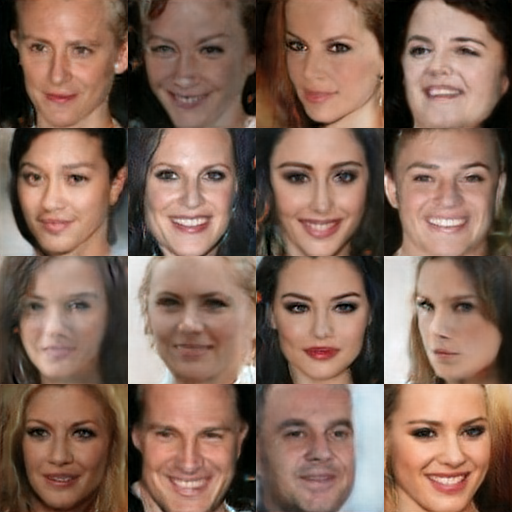
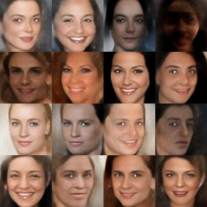
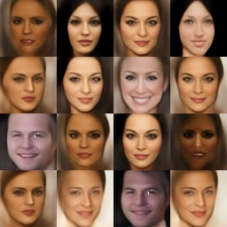
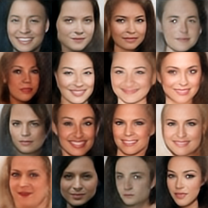
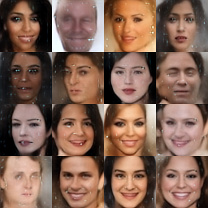
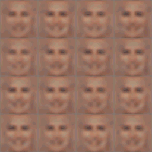
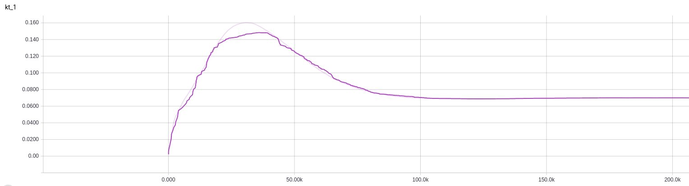
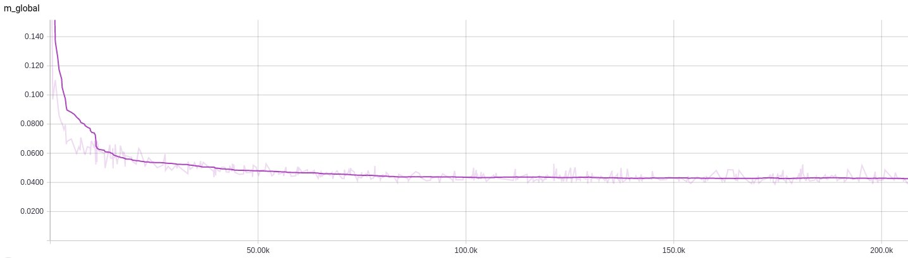
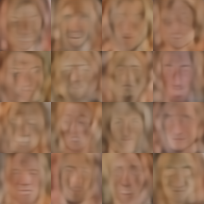

# BEGAN: Boundary Equilibrium Generative Adversarial Networks
Implementation of Google Brain's [BEGAN: Boundary Equilibrium Generative Adversarial Networks](https://arxiv.org/abs/1703.10717) in Tensorflow. \
BEGAN is the state of the art when it comes to generate realistic faces.

Figure1a. 128x128 img and 64x64 img. 128x128 img is very impressive. You can see SET OF TEETH

Figure1b. This is random result from my train model. From gamma 0.3 to 0.5. No cherry picking. gamma 0.3, nice but bias to women's face. gamma 0.4, Best. gamma 0.5, good texture but hole problem.

Figure1c. From scratch to 200k iter

## Implementation detail
This train model is 64x64. 128x128 will be update. Different with original paper is train loss update method, learning rate decay. First, paper's loss update way is Loss_G and Loss_D simultaneously. But when I tried that way, models are mode collapse. So, This code use altenative way. Second, learning rate decay is 0.95 every 2000 iter. This parameter is just train experienc. You can change or see the paper.

## Train progress
If you want to see the train progress download [this dropbox folder](https://www.dropbox.com/sh/g72k2crptow3ime/AAAhkGlHCw9zQh0aE-Ggdt3Qa?dl=0) and run "tensorboard --logdir='./'". I uploaded two trained model(64x64 and 128x128)

Figure2. Kt graph. When you train model, reference this result. It doesn't reach to 1.0. In my case, it's converge to 0.08

Figure3. Convergence measure(M_global). Similar with paper's graph

Figure4. Compare with Generator output and Decoder output.

## Usage
Recommend to download trained model [this dropbox folder](https://www.dropbox.com/sh/g72k2crptow3ime/AAAhkGlHCw9zQh0aE-Ggdt3Qa?dl=0).

### Make Train Data
1. Download [celebA dataset (img_align_celeba.zip)](http://pan.baidu.com/s/1eSNpdRG#list/path=%2FCelebA%2FImg) and unzip to 'Data/celeba/raw'
2. Run ' python ./Data/celeba/face_detect.py '

### Train (refer the main.py began_cmd)
    ex) 64x64 img | Nz,Nh 128 | gamma 0.4
    python3 main.py -f 1 -p "began" -trd "celeba" -tro "crop" -trs 64  -z 128 -em 128 -fn 64  -b 16 -lr 1e-4 -gm 0.4 -g "0"

    ex) 128x128 img | Nz,Nh 64 | gamma 0.7
    python3 main.py -f 1 -p "began" -trd "celeba" -tro "crop" -trs 128 -z 64  -em 64  -fn 128 -b 16 -lr 1e-4 -gm 0.7 -g "0"

### Test (refer the main.py and began_cmd)
    ex) 64x64 img | Nz,Nh 128 | gamma 0.4
    python3 main.py -f 0 -p "began" -trd "celeba" -tro "crop" -trs 64  -z 128 -em 128 -fn 64  -b 16 -lr 1e-4 -gm 0.4 -g "0"

    ex) 128x128 img | Nz,Nh 64 | gamma 0.7
    python3 main.py -f 0 -p "began" -trd "celeba" -tro "crop" -trs 128 -z 64  -em 64  -fn 128 -b 16 -lr 1e-4 -gm 0.7 -g "0"

## Requirements
- Python 3.5, scipy 0.18.1, numpy 1.11.2
- TensorFlow 1.1.0

## Author
Heumi / ckhfight@gmail.com

